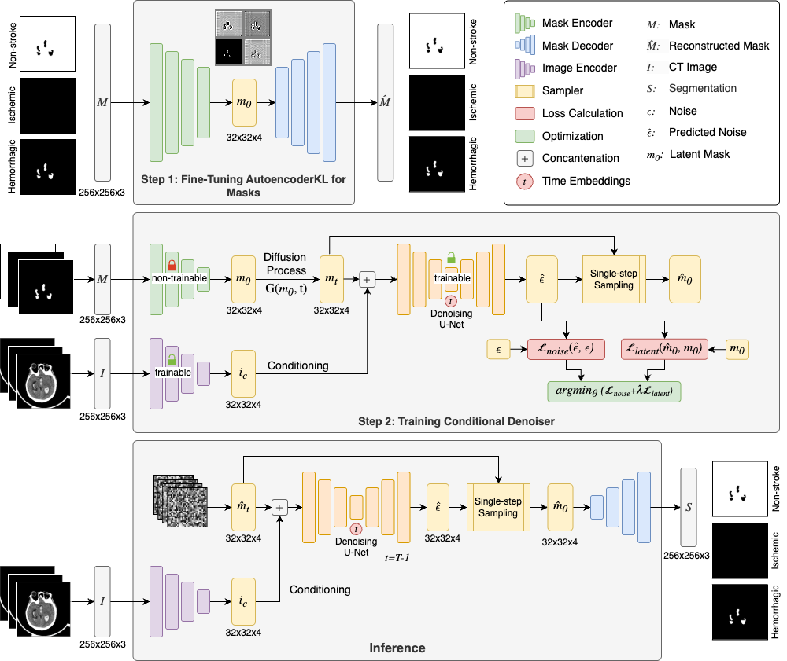
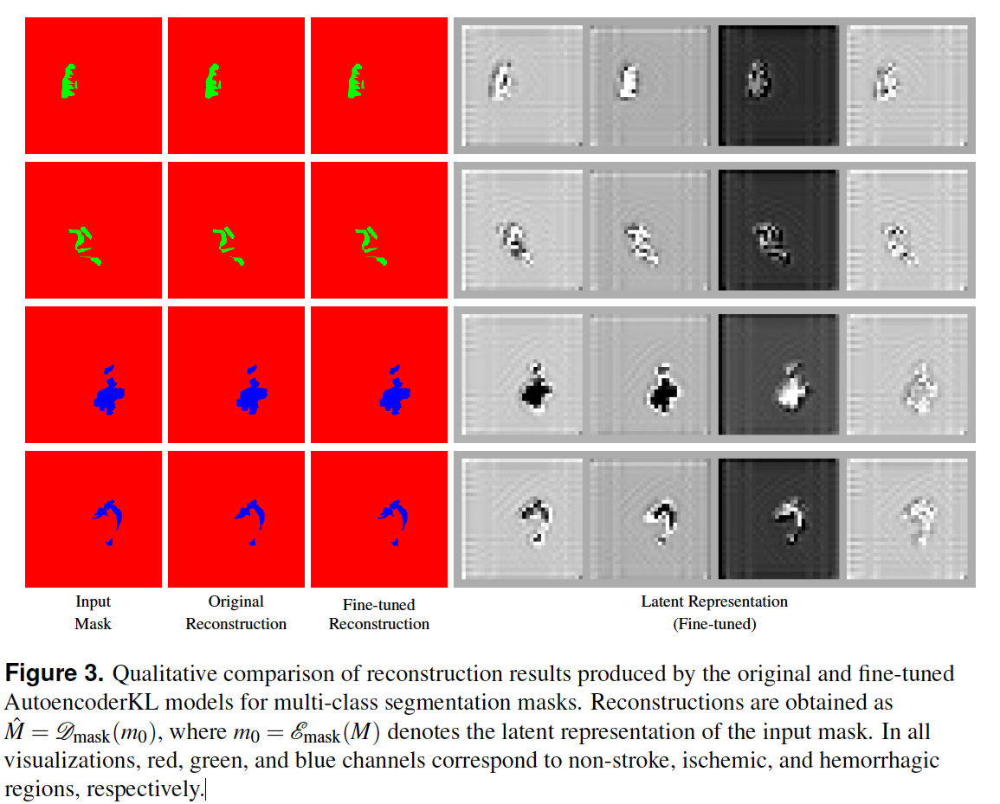
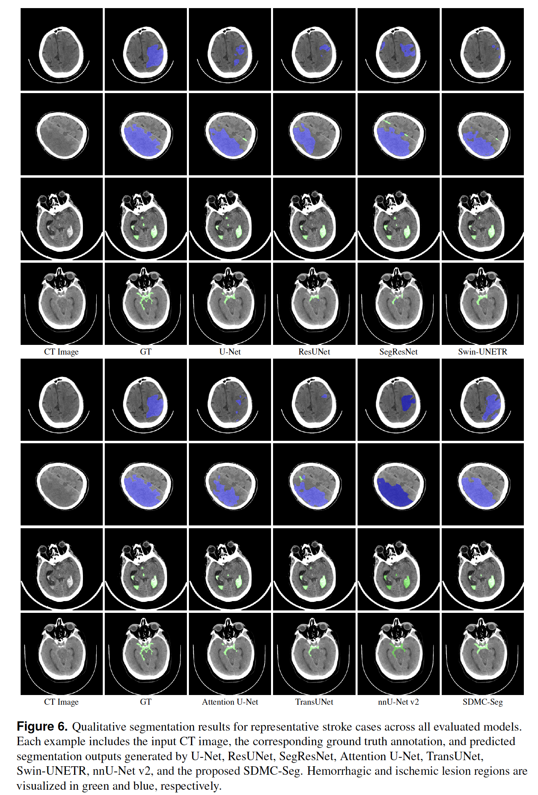

<p align="center">
 <h1 align="center">A Single-Step Latent Diffusion Model for Multi-Class Brain Stroke Segmentation</h2>


## 📌 Description
SDMC-Seg is a latent diffusion-based segmentation framework designed to segment ischemic and hemorrhagic stroke lesions in non-contrast brain CT scans. Unlike traditional diffusion models, SDMC-Seg performs mask reconstruction in a single denoising step within latent space, enabling rapid and structurally consistent predictions for clinical use.



## 📚 Acknowledgement

This repository builds upon the latent diffusion segmentation framework introduced in [Stable-Diffusion-Seg](https://github.com/lin-tianyu/Stable-Diffusion-Seg) by Lin et al. (MICCAI 2024). 

We extend their method for multi-class stroke lesion segmentation using fine-tuned mask encoders and a new clinical dataset (Stroke2021).

## 📂 Dataset Information
- Dataset: A curated and anonymized subset of the publicly available CT stroke dataset released by the Ministry of Health of the Republic of Türkiye (TEKNOFEST-2021).
- Link: https://acikveri.saglik.gov.tr/Home/DataSetDetail/1
- Number of annotated slices: 2,223 (3-class masks: ischemic, hemorrhagic, normal)

## Evaluation Metrics

Segmentation performance is evaluated using the following metrics:

- **Dice Similarity Coefficient (DSC)**: Measures the spatial overlap between the predicted segmentation and the ground truth mask.
- **Intersection over Union (IoU)**: Quantifies the ratio of the intersection area to the union area between prediction and ground truth.
- **Modified IoU (mIoU)**: A boundary-tolerant variant of IoU defined in the Stroke2021 protocol, computed using morphological dilation and erosion to account for minor annotation inconsistencies.
- **95th Percentile Hausdorff Distance (HD95)**: Measures boundary accuracy by computing the 95th percentile of the symmetric surface distance between predicted and ground truth contours, reducing sensitivity to outliers.
- **Sensitivity (Recall)**: Measures the proportion of correctly identified stroke pixels among all ground truth stroke pixels.
- **Specificity**: Measures the proportion of correctly identified non-stroke pixels among all ground truth non-stroke pixels.

All metrics are computed **class-wise for ischemic (IS) and hemorrhagic (HS) stroke lesions**. 
Lesion-only mean scores are reported as the arithmetic average over IS and HS classes, excluding the non-stroke background unless otherwise stated.

## Evaluation Protocol

Each model is evaluated on the **Stroke2021 dataset** using a two-stage protocol:
- A held-out **validate set** consisting of stroke-positive CT slices.
- Five-fold cross-validation on the remaining data, with results reported as mean ± standard deviation across folds.

All models are trained and evaluated under identical preprocessing, data augmentation, and optimization settings to ensure fair comparison.

## Ablation Study

An ablation study is conducted to analyze the contribution of key architectural components in the proposed SDMC-Seg framework. Specifically, we evaluate:
- The effect of **mask encoder fine-tuning** on class-discriminative latent representations.
- The impact of **image encoder adaptation** during conditional latent diffusion training.

Quantitative ablation results are reported in **Table 4**, demonstrating that jointly adapting both encoders yields consistent improvements across all evaluation metrics.


## 📊 Results

### Segmentation Performance

The table below reports five-fold cross-validation segmentation performance on the Stroke2021 dataset.
Results are reported **class-wise for ischemic (IS) and hemorrhagic (HS) stroke lesions**, along with the **lesion-only mean**, computed as the arithmetic average of IS and HS, excluding the non-stroke (NS) background.

#### Dice Similarity Coefficient (DSC)

| Model             | IS            | HS            | Mean          |
|------------------|---------------|---------------|---------------|
| U-Net            | 0.620 ± 0.022 | 0.798 ± 0.026 | 0.709 ± 0.016 |
| ResUNet (R34)    | 0.629 ± 0.019 | 0.793 ± 0.029 | 0.711 ± 0.021 |
| SegResNet        | 0.620 ± 0.032 | 0.807 ± 0.025 | 0.714 ± 0.020 |
| Swin-UNETR       | 0.605 ± 0.020 | 0.794 ± 0.033 | 0.699 ± 0.014 |
| Attention U-Net  | 0.587 ± 0.030 | 0.779 ± 0.029 | 0.683 ± 0.015 |
| TransUNet        | 0.464 ± 0.017 | 0.740 ± 0.044 | 0.602 ± 0.022 |
| nnU-Net v2       | 0.626 ± 0.013 | 0.813 ± 0.029 | 0.718 ± 0.019 |
| **SDMC-Seg (Ours)** | **0.668 ± 0.038** | **0.822 ± 0.020** | **0.745 ± 0.019** |


#### Intersection over Union (IoU)

| Model             | IS            | HS            | Mean          |
|------------------|---------------|---------------|---------------|
| U-Net            | 0.508 ± 0.020 | 0.707 ± 0.025 | 0.607 ± 0.014 |
| ResUNet (R34)    | 0.517 ± 0.019 | 0.704 ± 0.028 | 0.610 ± 0.020 |
| SegResNet        | 0.511 ± 0.030 | 0.717 ± 0.030 | 0.614 ± 0.021 |
| Swin-UNETR       | 0.496 ± 0.021 | 0.703 ± 0.034 | 0.599 ± 0.015 |
| Attention U-Net  | 0.475 ± 0.027 | 0.686 ± 0.029 | 0.581 ± 0.014 |
| TransUNet        | 0.363 ± 0.014 | 0.641 ± 0.044 | 0.502 ± 0.022 |
| nnU-Net v2       | 0.531 ± 0.014 | 0.730 ± 0.030 | 0.629 ± 0.018 |
| **SDMC-Seg (Ours)** | **0.575 ± 0.041** | **0.737 ± 0.020** | **0.656 ± 0.024** |


#### Modified IoU (mIoU) and Boundary Accuracy (HD95)

| Model             | mIoU (Mean)   | HD95 (Mean ↓) |
|------------------|---------------|----------------|
| U-Net            | 0.722 ± 0.017 | 20.04 ± 0.55  |
| ResUNet (R34)    | 0.727 ± 0.020 | 17.41 ± 0.89  |
| SegResNet        | 0.730 ± 0.021 | 20.09 ± 2.15  |
| Swin-UNETR       | 0.715 ± 0.015 | 19.11 ± 1.08  |
| Attention U-Net  | 0.694 ± 0.016 | 22.22 ± 1.23  |
| TransUNet        | 0.608 ± 0.024 | 24.95 ± 1.81  |
| nnU-Net v2       | 0.743 ± 0.020 | 12.77 ± 0.37  |
| **SDMC-Seg (Ours)** | **0.778 ± 0.020** | **13.00 ± 2.25** |

### Clinical Metrics: Sensitivity and Specificity

The table below reports five-fold cross-validation performance in terms of **Sensitivity** and **Specificity** on the Stroke2021 dataset.
Results are reported class-wise for ischemic (IS) and hemorrhagic (HS) stroke lesions, along with the lesion-only mean computed as the arithmetic average of IS and HS, excluding the non-stroke (NS) background.

#### Sensitivity

| Model             | IS            | HS            | Mean          |
|------------------|---------------|---------------|---------------|
| U-Net            | 0.648 ± 0.019 | 0.803 ± 0.020 | 0.724 ± 0.017 |
| ResUNet (R34)    | 0.649 ± 0.029 | 0.786 ± 0.033 | 0.717 ± 0.025 |
| SegResNet        | 0.647 ± 0.031 | 0.819 ± 0.020 | 0.731 ± 0.017 |
| Swin-UNETR       | 0.605 ± 0.021 | 0.797 ± 0.040 | 0.699 ± 0.014 |
| Attention U-Net  | 0.595 ± 0.038 | 0.782 ± 0.037 | 0.688 ± 0.019 |
| TransUNet        | 0.466 ± 0.021 | 0.737 ± 0.042 | 0.599 ± 0.025 |
| nnU-Net v2       | 0.630 ± 0.015 | 0.801 ± 0.027 | 0.714 ± 0.019 |
| **SDMC-Seg (Ours)** | **0.667 ± 0.052** | **0.823 ± 0.031** | **0.743 ± 0.029** |

#### Specificity

| Model             | IS            | HS            | Mean          |
|------------------|---------------|---------------|---------------|
| U-Net            | 0.995 ± 0.001 | 0.999 ± 0.000 | 0.997 ± 0.000 |
| ResUNet (R34)    | 0.995 ± 0.002 | 0.999 ± 0.000 | 0.997 ± 0.001 |
| SegResNet        | 0.995 ± 0.000 | 0.999 ± 0.000 | 0.997 ± 0.000 |
| Swin-UNETR       | 0.996 ± 0.000 | 0.999 ± 0.000 | 0.998 ± 0.000 |
| Attention U-Net  | 0.996 ± 0.001 | 0.999 ± 0.000 | 0.997 ± 0.000 |
| TransUNet        | 0.994 ± 0.000 | 0.999 ± 0.000 | 0.996 ± 0.000 |
| nnU-Net v2       | 0.997 ± 0.000 | 0.999 ± 0.000 | 0.998 ± 0.000 |
| **SDMC-Seg (Ours)** | **0.997 ± 0.001** | **0.999 ± 0.000** | **0.998 ± 0.001** |

---

### 🔸 Ablation Study
We conducted an ablation study to assess the impact of encoder initialization and trainability on segmentation performance. The table below summarizes lesion-only mean results (IS+HS), excluding the non-stroke background.

| Mask Encoder / Image Encoder | Mean DSC | Mean IoU | Mean mIoU | HD95 (↓) | Sensitivity | Specificity |
|------------------------------|----------|----------|-----------|----------|-------------|-------------|
| Pretrained / Trainable       | 0.634±0.023 | 0.529±0.021 | 0.653±0.023 | 19.17±2.03 | 0.646±0.032 | 0.998±0.001 |
| Fine-tuned / Frozen          | 0.507±0.028 | 0.455±0.027 | 0.521±0.029 | 22.57±2.49 | 0.517±0.035 | 0.996±0.001 |
| **Fine-tuned / Trainable**   | **0.745±0.019** | **0.656±0.024** | **0.778±0.020** | **13.00±2.25** | **0.743±0.029** | **0.998±0.001** |

> Mean scores are lesion-only averages computed over ischemic (IS) and hemorrhagic (HS) classes, excluding the non-stroke (NS) background.

## 📷 Qualitative Results

### 🔹 Mask Reconstruction Quality

Comparison of segmentation mask reconstructions produced by the original and fine-tuned **AutoencoderKL** models:

> Red: Non-stroke, Green: Ischemic Stroke, Blue: Hemorrhagic Stroke  

<p align="center">
  
</p>

---

### 🔸 Segmentation Output Samples

Representative segmentation outputs of **SDMC-Seg** compared to baseline models.

<p align="center">
  
</p>


---

## ⚙️ Requirements

A suitable [conda](https://conda.io/) environment named `sdmcseg` can be created
and activated with:

```bash
conda env create -f environment.yaml
conda activate sdmcseg
```

Then, install some dependencies by:
```bash
pip install -e git+https://github.com/CompVis/taming-transformers.git@master#egg=taming-transformers
pip install -e git+https://github.com/openai/CLIP.git@main#egg=clip
pip install -e .
```

    
<details>

<summary>Solve GitHub connection issues when downloading <code class="inlinecode">taming-transformers</code> or <code class="inlinecode">clip</code></summary>


After creating and entering the `sdmcseg` environment:
1. create an `src` folder and enter:
```bash
mkdir src
cd src
```
2. download the following codebases in `*.zip` files and upload to `src/`:
    - https://github.com/CompVis/taming-transformers, `taming-transformers-master.zip`
    - https://github.com/openai/CLIP, `CLIP-main.zip`
3. unzip and install taming-transformers:
```bash
unzip taming-transformers-master.zip
cd taming-transformers-master
pip install -e .
cd ..
```
4. unzip and install clip:
```bash
unzip CLIP-main.zip
cd CLIP-main
pip install -e .
cd ..
```
5. install latent-diffusion:
```bash
cd ..
pip install -e .
```

Then you're good to go!

</details>


## 🧠 Dataset Download and Preparation

This repository supports automatic download and preprocessing of the TEKNOFEST 2021 Stroke Dataset, provided by the Turkish Ministry of Health Open Data Portal.

### 📥 Download Dataset

To download and extract the full dataset (nonstroke, ischemic, and hemorrhagic samples)
```bash
python download_dataset.py
```
This script will:
- Download all dataset parts from the official source,
- Merge and extract them into the downloads/stroke2021/Training/ directory,
- Organize subfolders by class (Non-Stroke, Ischemic, Hemorrhagic) and image type (PNG, DICOM, OVERLAY).

### ⚙️ Prepare Dataset

To generate masks from overlay images and prepare image-mask pairs:
```bash
python prepare_dataset.py
```
This script will:
- Extract segmentation masks from overlay images for each class,
- Copy original PNG and DICOM images into the dataset/stroke2021/imageTr directory,
- Save the corresponding masks into dataset/stroke2021/maskTr,
- Generate a dataset.json metadata file describing all image-mask pairs.

✅ Output format: PNG and DICOM.


```bash
📂 dataset/stroke2021/
├── imageTr/     # PNG + DICOM images
├── maskTr/      # grayscale PNG masks with 0: nonstroke, 1: ischemic, 2: hemorrhagic
└── dataset.json # metadata
└── splits.json # 5-fold train/validation splits
```

## 📦 Model Weights

### Pretrained Models
SDMCSeg uses pre-trained weights from SD to initialize before training.

For pre-trained weights of the autoencoder and conditioning model, run

```bash
bash scripts/download_first_stages_f8.sh
```

For pre-trained wights of the denoising UNet, run

```bash
bash scripts/download_models_lsun_churches.sh
```

### Fine-tuned Mask Encoder

We provide a fine-tuned checkpoint for the **mask encoder**, trained on the Stroke2021 dataset (TEKNOFEST) for multi-class brain lesion segmentation.

To download the fine-tuned weights for the mask encoder, run:

```bash
mkdir -p models/first_stage_models/kl-f8 && \
wget -O models/first_stage_models/kl-f8/model_finetuned_mask.ckpt \
https://github.com/arozcan/sdmc-seg/releases/download/v1.0/model_finetuned_mask.ckpt
```

## 📄 Scripts
### 🔄 Retrain the Mask Autoencoder (Optional)
This project provides a fine-tuned version of the **Stable Diffusion's KL-based first-stage autoencoder** (`model.ckpt`), optimized using the segmentation masks from the **Stroke2021** dataset.

If you prefer to re-train this module yourself, you can fine-tune it from the original checkpoint using the following script:
```bash
python main.py \
  --base configs/autoencoder/autoencoder_kl_32x32x4_stroke_mask.yaml \
  -t \
  --accelerator gpu \
  --gpus 0, \
  -n autoencoder_kl_f8_stroke_mask \
  --resume_from_checkpoint models/first_stage_models/kl-f8/model.ckpt \
  --max_epochs 50
```


### 🚀 Training Scripts
This repository provides three training configurations for the SDMC-Seg model, each corresponding to different encoder initialization and training strategies as used in the ablation study (see Table 4 in the paper).

#### 🧪 1. Pretrained Mask Encoder / Trainable Image Encoder
This configuration uses the original Stable Diffusion mask autoencoder (model.ckpt) without fine-tuning. The CT image encoder is initialized from SD and remains trainable.

```bash
python main.py \
  --base configs/SDMCSeg/stroke-ldm-kl-8.yaml \
  -t \
  --accelerator gpu \
  --gpus 0, \
  -n latent_diffusion \
  --max_epochs 300
```

#### 🔒 2. Fine-Tuned Mask Encoder / ❄️ Frozen Image Encoder
This setup uses a fine-tuned mask encoder (model_finetuned_mask.ckpt) but freezes the image encoder, preventing it from adapting to the CT domain.

```bash
python main.py \
  --base configs/SDMCSeg/stroke-ldm-kl-8_finetuned_nocondtrain.yaml \
  -t \
  --accelerator gpu \
  --gpus 0, \
  -n latent_diffusion_finetuned_nocondtrain \
  --max_epochs 300
```

#### ✅ 3. Proposed: Fine-Tuned Mask Encoder / Trainable Image Encoder
This is the recommended full SDMC-Seg configuration, where both encoders are optimized for the stroke segmentation task.

```bash
python main.py \
  --base configs/SDMCSeg/stroke-ldm-kl-8_finetuned.yaml \
  -t \
  --accelerator gpu \
  --gpus 0, \
  -n latent_diffusion_finetuned \
  --max_epochs 300
```

### 🏁 Baseline Models
For fair comparison, we trained several commonly used segmentation architectures on the same dataset under consistent conditions. See Table 3 in the paper. Each configuration can be launched with the following commands:

#### 1. U-Net
U-Net model trained from scratch.
```bash
python main.py \
  --base configs/unet/stroke-basic_unet.yaml \
  -t \
  --accelerator gpu \
  --gpus 0, \
  -n basic_unet \
  --max_epochs 300
```

#### 2. ResUNet (with ResNet-34 Backbone)
A U-Net variant that uses a pretrained ResNet-34 encoder.
```bash
python main.py \
  --base configs/unet/stroke-unet_resnet34.yaml \
  -t \
  --accelerator gpu \
  --gpus 0, \
  -n unet_resnet34 \
  --max_epochs 300
```

#### 3. Swin-UNETR
A Transformer-based U-Net architecture utilizing Swin Transformer blocks, implemented via MONAI.
```bash
python main.py \
  --base configs/unet/stroke-swinunetr.yaml \
  -t \
  --accelerator gpu \
  --gpus 0, \
  -n swinunetr \
  --max_epochs 300
```

#### 4. SegResNet
A ResNet-style segmentation model from MONAI designed for medical image segmentation.
```bash
python main.py \
  --base configs/unet/stroke-segresnet.yaml \
  -t \
  --accelerator gpu \
  --gpus 0, \
  -n segresnet \
  --max_epochs 300
```

#### 5. TransUnet
A TransUnet segmentation model from MONAI designed for medical image segmentation.
```bash
python main.py \
  --base configs/unet/stroke-transunet.yaml \
  -t \
  --accelerator gpu \
  --gpus 0, \
  -n transunet \
  --max_epochs 300
```

#### 6. Attention Unet
An Attention Unet segmentation model from MONAI designed for medical image segmentation.
```bash
python main.py \
  --base configs/unet/stroke-attention_unet.yaml \
  -t \
  --accelerator gpu \
  --gpus 0, \
  -n attention_unet \
  --max_epochs 300
```


### validation Scripts
Once training is complete, you can evaluate the trained models using the corresponding validation commands below. These scripts will load the best checkpoint and compute class-wise metrics including Dice, IoU, mIoU, HD95, sensitivity, specificity.

#### 🧠 SDMC-Seg (Latent Diffusion Variants)

#### 🔹 1. Latent Diffusion (Base)
```bash
python validate.py --model ldm --ckpt logs/2025-01-01T12-00-00_latent_diffusion/checkpoints/epoch=XXX-step=YYYYY.ckpt \
  data.params.validation.params.fold=0
```
#### 🔹 2. Latent Diffusion (Fine-tuned, Frozen Conditional)
```bash 
python validate.py --model ldm_finetuned_nocondtrain --ckpt logs/2025-01-01T12-00-00_latent_diffusion_finetuned_nocondtrain/checkpoints/epoch=XXX-step=YYYYY.ckpt \
  data.params.validation.params.fold=0
```
#### 🔹 3. Proposed: Latent Diffusion (Fine-tuned)
```bash
python validate.py --model ldm_finetuned --ckpt logs/2025-01-01T12-00-00_latent_diffusion_finetuned/checkpoints/epoch=XXX-step=YYYYY.ckpt \
  data.params.validation.params.fold=0
```

#### 🏁 Baseline Models
####  1. U-Net
```bash
python validate.py --model basic_unet --ckpt logs/2025-01-01T12-00-00_basic_unet/checkpoints/epoch=XXX-step=YYYYY.ckpt \
  data.params.validation.params.fold=0
```
####  2. ResUNet (ResNet-34)
```bash
python validate.py --model resunet_resnet34 --ckpt logs/2025-01-01T12-00-00_unet_resnet34/checkpoints/epoch=XXX-step=YYYYY.ckpt \
  data.params.validation.params.fold=0
```
####  3. Swin-UNETR
```bash
python validate.py --model swinunetr --ckpt logs/2025-01-01T12-00-00_swinunetr/checkpoints/epoch=XXX-step=YYYYY.ckpt \
  data.params.validation.params.fold=0
```
####  4. SegResNet
```bash
python validate.py --model segresnet --ckpt logs/2025-01-01T12-00-00_segresnet/checkpoints/epoch=XXX-step=YYYYY.ckpt \
  data.params.validation.params.fold=0
```

####  5. TransUnet
```bash
python validate.py --model transunet --ckpt logs/2025-01-01T12-00-00_transunet/checkpoints/epoch=XXX-step=YYYYY.ckpt \
  data.params.validation.params.fold=0
```

####  6. Attention Unet
```bash
python validate.py --model attention_unet --ckpt logs/2025-01-01T12-00-00_attention_unet/checkpoints/epoch=XXX-step=YYYYY.ckpt \
  data.params.validation.params.fold=0
```

### nnU-Net v2 (Separate Environment)
nnU-Net v2 is trained and evaluated using its own fully automated pipeline, which differs from the MONAI / PyTorch-Lightning–based baselines used in this repository.
Therefore, a separate conda environment must be created, and training is performed using nnU-Net’s native commands

#### Create a dedicated environment

```bash
conda create -n nnunetv2 python=3.10 -y
conda activate nnunetv2

pip install -U pip
pip install nnunetv2
```

#### Set nnU-Net directory paths
```bash
export nnUNet_raw=./nnunet/raw
export nnUNet_preprocessed=./nnunet/preprocessed
export nnUNet_results=./nnunet/results
```

#### Dataset planning and preprocessing
Before training, nnU-Net v2 performs automatic dataset fingerprinting, experiment planning, and preprocessing.
```bash
nnUNetv2_plan_and_preprocess -d DATASET_ID --verify_dataset_integrity
```
This step verifies dataset integrity, determines optimal patch size, spacing, and network configuration, and prepares the preprocessed data required for training.

#### Training (2D, 5-fold cross-validation)
Replace DATASET_ID with the corresponding nnU-Net dataset identifier.
```bash
for f in 0 1 2 3 4; do
  nnUNetv2_train DATASET_ID 2d $f
done
```

#### Validation (fold-wise, val-only mode)
In nnU-Net v2, validation on the internal validation split of each fold is performed using the `--val` flag.
This runs inference on the validation cases of the specified fold **without retraining**.

```bash
for f in 0 1 2 3 4; do
  nnUNetv2_train --val DATASET_ID 2d $f
done
```

#### External Evaluation of nnU-Net v2 Predictions
Although nnU-Net v2 provides its own internal evaluation metrics, all nnU-Net predictions are **re-evaluated using the same custom evaluation pipeline** employed for the proposed SDMC-Seg and all baseline models.  
This ensures a **fair and consistent comparison** across methods, particularly for lesion-focused metrics.

The following command is used to compute Dice, IoU, modified IoU (mIoU), HD95, Sensitivity, and Specificity for nnU-Net v2 predictions:

```bash
python nnunet/evaluate_nnunet.py \
  --gt_dir nnunet/raw/Dataset001_Stroke/labelsTr \
  --pred_dir nnunet/results/Dataset001_Stroke/nnUNetTrainer__nnUNetPlans__2d/fold_0/validation \
  --labels 1 2 \
  --tiou_radius 1 \
  --out_csv nnunet/results/Dataset001_Stroke/nnunet_fold0_val_metrics.csv \
  --img_dir nnunet/raw/Dataset001_Stroke/imagesTr \
  --overlay_dir nnunet/results/Dataset001_Stroke/overlays_fold0 \
  --overlay_alpha 0.5
```

Arguments:
- --gt_dir        : Ground-truth segmentation masks
- --pred_dir      : nnU-Net v2 validation predictions for the given fold
- --labels 1 2    : Stroke lesion labels (1 = ischemic, 2 = hemorrhagic)
- --tiou_radius   : Radius parameter for modified IoU (mIoU) computation
- --out_csv       : Output CSV file storing per-case and aggregated metrics
- --img_dir       : Original CT images (used for visualization)
- --overlay_dir   : Directory for saving qualitative overlay visualizations
- --overlay_alpha : Transparency factor for mask overlays


## 📝 Citation
If you find our work useful, please cite:
```bibtex
@misc{ozcan2025sdmcseg,
  title        = {A Single-Step Latent Diffusion Model for Multi-Class Brain Stroke Segmentation},
  author       = {Özcan, Ahmet Remzi},
  year         = {2025},
  howpublished = {\url{https://github.com/arozcan/sdmc-seg}}
}

@inproceedings{lin2024stable,
  title     = {Stable Diffusion Segmentation for Biomedical Images with Single-Step Reverse Process},
  author    = {Lin, Tianyu and Chen, Zhiguang and Yan, Zhonghao and Yu, Weijiang and Zheng, Fudan},
  booktitle = {MICCAI},
  year      = {2024},
  pages     = {656--666},
  publisher = {Springer}
}
```

## 📄 License

This repository is licensed under the MIT License. See the [LICENSE](LICENSE) file for details.

## 🤝 Contribution

Contributions are welcome! Please open an issue or submit a pull request.
