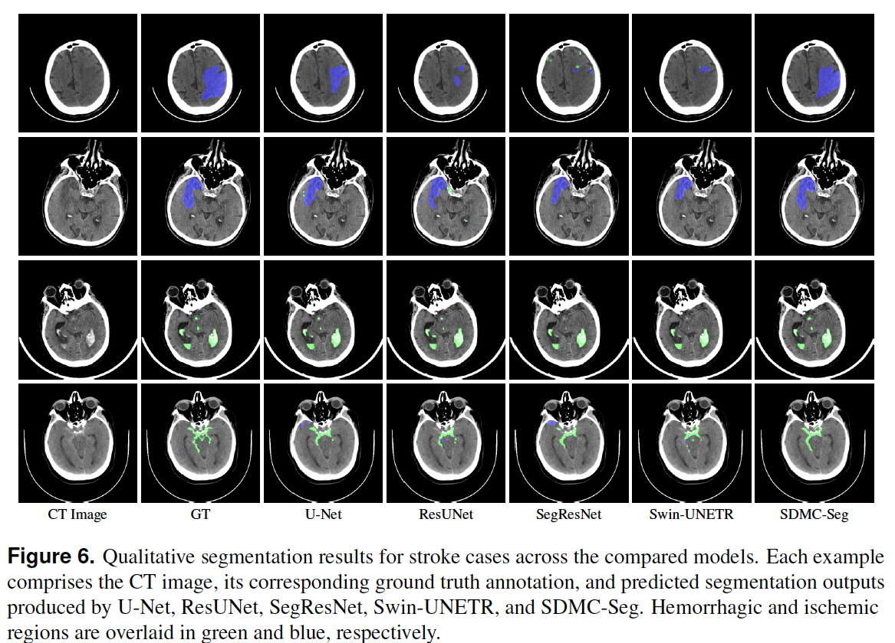

<p align="center">
 <h1 align="center">SDMC-Seg: A Single-Step Latent Diffusion Framework for Multi-Class Stroke Lesion Segmentation in Brain CT</h2>


## 📌 Description
SDMC-Seg is a latent diffusion-based segmentation framework designed to segment ischemic and hemorrhagic stroke lesions in non-contrast brain CT scans. Unlike traditional diffusion models, SDMC-Seg performs mask reconstruction in a single denoising step within latent space, enabling rapid and structurally consistent predictions for clinical use.


## 📚 Acknowledgement

This repository builds upon the latent diffusion segmentation framework introduced in [Stable-Diffusion-Seg](https://github.com/lin-tianyu/Stable-Diffusion-Seg) by Lin et al. (MICCAI 2024). 

We extend their method for multi-class stroke lesion segmentation using fine-tuned mask encoders and a new clinical dataset (Stroke2021).

## 📂 Dataset Information
- Dataset: A curated and anonymized subset of the publicly available CT stroke dataset released by the Ministry of Health of the Republic of Türkiye (TEKNOFEST-2021).
- Link: https://acikveri.saglik.gov.tr/Home/DataSetDetail/1
- Number of annotated slices: 2,223 (3-class masks: ischemic, hemorrhagic, normal)

## 🧪 Evaluation Methodology

We evaluate segmentation performance using:

- **Dice Similarity Coefficient (DSC)**: Measures overlap between predicted and ground truth segmentation.
- **Intersection over Union (IoU)**: Measures the ratio of overlap to the union area.
- **Modified IoU (mIoU)**: Emphasizes stroke regions by weighting classes differently.

Each model is evaluated on the **Stroke2021** test set with class-wise and mean scores reported. We also perform an **ablation study** to evaluate the effect of mask encoder fine-tuning and image encoder freezing (see Table 4).

## 📊 Results

### 🔹 Segmentation Performance (Table 3)

The table below compares the segmentation performance of SDMC-Seg and baseline models on the Stroke2021 dataset across three classes: Non-stroke (NS), Ischemic Stroke (IS), and Hemorrhagic Stroke (HS). Metrics include Dice Similarity Coefficient (DSC), Intersection over Union (IoU), and modified IoU (mIoU).

| Model               | DSC (NS) | DSC (IS) | DSC (HS) | DSC (Mean) | IoU (NS) | IoU (IS) | IoU (HS) | IoU (Mean) | mIoU (NS) | mIoU (IS) | mIoU (HS) | mIoU (Mean) |
|---------------------|----------|----------|----------|------------|----------|----------|----------|------------|-----------|-----------|-----------|-------------|
| U-Net               | 0.996    | 0.626    | 0.799    | 0.712      | 0.991    | 0.513    | 0.703    | 0.608      | 0.993     | 0.600     | 0.839     | 0.720       |
| ResUNet (w/R34)     | 0.997    | 0.649    | 0.806    | 0.727      | 0.993    | 0.543    | 0.723    | 0.633      | 0.995     | 0.635     | 0.862     | 0.748       |
| SegResNet           | 0.996    | 0.639    | 0.809    | 0.724      | 0.993    | 0.533    | 0.721    | 0.627      | 0.995     | 0.625     | 0.860     | 0.743       |
| Swin-UNETR          | 0.996    | 0.608    | 0.802    | 0.705      | 0.993    | 0.498    | 0.711    | 0.605      | 0.995     | 0.586     | 0.853     | 0.720       |
| **SDMC-Seg (Ours)** | 0.998    | 0.700    | 0.819    | **0.760**  | 0.995    | 0.597    | 0.733    | **0.665**  | 0.997     | 0.700     | 0.882     | **0.791**   |

> **NS:** Non-Stroke **IS:** Ischemic Stroke **HS:** Hemorrhagic Stroke \
> **Mean** scores are calculated as the arithmetic average of the IS and HS class scores, excluding NS.

---

### 🔸 Ablation Study (Table 4)

We conducted an ablation study to assess the impact of encoder initialization and trainability on segmentation performance. The table below summarizes the mean Dice Similarity Coefficient (DSC), Intersection over Union (IoU), and modified IoU (mIoU) across all three classes.

| Mask Encoder / Image Encoder | Mean DSC | Mean IoU | Mean mIoU |
|------------------------------|----------|----------|-----------|
| Pretrained / Trainable       | 0.6403   | 0.5477   | 0.6634    |
| Fine-tuned / Frozen          | 0.5393   | 0.4461   | 0.5479    |
| **Fine-tuned / Trainable**   | **0.7595** | **0.6647** | **0.7909** |

## 📷 Qualitative Results

### 🔹 Mask Reconstruction Quality

Comparison of segmentation mask reconstructions produced by the original and fine-tuned **AutoencoderKL** models:

> Red: Non-stroke, Green: Ischemic Stroke, Blue: Hemorrhagic Stroke  

<p align="center">
  
</p>

---

### 🔸 Segmentation Output Samples

Representative segmentation outputs of **SDMC-Seg** compared to baseline models.

<p align="center">
  
</p>


---

## ⚙️ Requirements

A suitable [conda](https://conda.io/) environment named `sdmcseg` can be created
and activated with:

```bash
conda env create -f environment.yaml
conda activate sdmcseg
```

Then, install some dependencies by:
```bash
pip install -e git+https://github.com/CompVis/taming-transformers.git@master#egg=taming-transformers
pip install -e git+https://github.com/openai/CLIP.git@main#egg=clip
pip install -e .
```

    
<details>

<summary>Solve GitHub connection issues when downloading <code class="inlinecode">taming-transformers</code> or <code class="inlinecode">clip</code></summary>


After creating and entering the `sdmcseg` environment:
1. create an `src` folder and enter:
```bash
mkdir src
cd src
```
2. download the following codebases in `*.zip` files and upload to `src/`:
    - https://github.com/CompVis/taming-transformers, `taming-transformers-master.zip`
    - https://github.com/openai/CLIP, `CLIP-main.zip`
3. unzip and install taming-transformers:
```bash
unzip taming-transformers-master.zip
cd taming-transformers-master
pip install -e .
cd ..
```
4. unzip and install clip:
```bash
unzip CLIP-main.zip
cd CLIP-main
pip install -e .
cd ..
```
5. install latent-diffusion:
```bash
cd ..
pip install -e .
```

Then you're good to go!

</details>


## 🧠 Dataset Download and Preparation

This repository supports automatic download and preprocessing of the TEKNOFEST 2021 Stroke Dataset, provided by the Turkish Ministry of Health Open Data Portal.

### 📥 Download Dataset

To download and extract the full dataset (nonstroke, ischemic, and hemorrhagic samples)
```bash
python download_dataset.py
```
This script will:
- Download all dataset parts from the official source,
- Merge and extract them into the downloads/stroke2021/Training/ directory,
- Organize subfolders by class (Non-Stroke, Ischemic, Hemorrhagic) and image type (PNG, DICOM, OVERLAY).

### ⚙️ Prepare Dataset

To generate masks from overlay images and prepare image-mask pairs:
```bash
python prepare_dataset.py
```
This script will:
- Extract segmentation masks from overlay images for each class,
- Copy original PNG and DICOM images into the dataset/stroke2021/imageTr directory,
- Save the corresponding masks into dataset/stroke2021/maskTr,
- Generate a dataset.json metadata file describing all image-mask pairs.

✅ Output format: PNG and DICOM.


```bash
📂 dataset/stroke2021/
├── imageTr/     # PNG + DICOM images
├── maskTr/      # grayscale PNG masks with 0: nonstroke, 1: ischemic, 2: hemorrhagic
└── dataset.json # metadata
```

## 📦 Model Weights

### Pretrained Models
SDMCSeg uses pre-trained weights from SD to initialize before training.

For pre-trained weights of the autoencoder and conditioning model, run

```bash
bash scripts/download_first_stages_f8.sh
```

For pre-trained wights of the denoising UNet, run

```bash
bash scripts/download_models_lsun_churches.sh
```

### Fine-tuned Mask Encoder

We provide a fine-tuned checkpoint for the **mask encoder**, trained on the Stroke2021 dataset (TEKNOFEST) for multi-class brain lesion segmentation.

To download the fine-tuned weights for the mask encoder, run:

```bash
mkdir -p models/first_stage_models/kl-f8 && \
wget -O models/first_stage_models/kl-f8/model_finetuned_mask.ckpt \
https://github.com/arozcan/sdmc-seg/releases/download/v1.0/model_finetuned_mask.ckpt
```

## 📄 Scripts
### 🔄 Retrain the Mask Autoencoder (Optional)
This project provides a fine-tuned version of the **Stable Diffusion's KL-based first-stage autoencoder** (`model.ckpt`), optimized using the segmentation masks from the **Stroke2021** dataset.

If you prefer to re-train this module yourself, you can fine-tune it from the original checkpoint using the following script:
```bash
python main.py \
  --base configs/autoencoder/autoencoder_kl_32x32x4_stroke_mask.yaml \
  -t \
  --accelerator gpu \
  --gpus 0, \
  -n autoencoder_kl_f8_stroke_mask \
  --resume_from_checkpoint models/first_stage_models/kl-f8/model.ckpt \
  --max_epochs 50
```


### 🚀 Training Scripts
This repository provides three training configurations for the SDMC-Seg model, each corresponding to different encoder initialization and training strategies as used in the ablation study (see Table 4 in the paper).

#### 🧪 1. Pretrained Mask Encoder / Trainable Image Encoder
This configuration uses the original Stable Diffusion mask autoencoder (model.ckpt) without fine-tuning. The CT image encoder is initialized from SD and remains trainable.

```bash
python main.py \
  --base configs/SDMCSeg/stroke-ldm-kl-8.yaml \
  -t \
  --accelerator gpu \
  --gpus 0, \
  -n latent_diffusion \
  --max_epochs 300
```

#### 🔒 2. Fine-Tuned Mask Encoder / ❄️ Frozen Image Encoder
This setup uses a fine-tuned mask encoder (model_finetuned_mask.ckpt) but freezes the image encoder, preventing it from adapting to the CT domain.

```bash
python main.py \
  --base configs/SDMCSeg/stroke-ldm-kl-8_finetuned_nocondtrain.yaml \
  -t \
  --accelerator gpu \
  --gpus 0, \
  -n latent_diffusion_finetuned_nocondtrain \
  --max_epochs 300
```

#### ✅ 3. Proposed: Fine-Tuned Mask Encoder / Trainable Image Encoder
This is the recommended full SDMC-Seg configuration, where both encoders are optimized for the stroke segmentation task.

```bash
python main.py \
  --base configs/SDMCSeg/stroke-ldm-kl-8_finetuned.yaml \
  -t \
  --accelerator gpu \
  --gpus 0, \
  -n latent_diffusion_finetuned \
  --max_epochs 300
```

### 🏁 Baseline Models
For fair comparison, we trained several commonly used segmentation architectures on the same dataset under consistent conditions. See Table 3 in the paper. Each configuration can be launched with the following commands:

#### 🔹 1. U-Net
U-Net model trained from scratch.
```bash
python main.py \
  --base configs/unet/stroke-basic_unet.yaml \
  -t \
  --accelerator gpu \
  --gpus 0, \
  -n basic_unet \
  --max_epochs 300
```

#### 🔸 2. ResUNet (with ResNet-34 Backbone)
A U-Net variant that uses a pretrained ResNet-34 encoder.
```bash
python main.py \
  --base configs/unet/stroke-unet_resnet34.yaml \
  -t \
  --accelerator gpu \
  --gpus 0, \
  -n unet_resnet34 \
  --max_epochs 300
```

#### 🧠 3. Swin-UNETR
A Transformer-based U-Net architecture utilizing Swin Transformer blocks, implemented via MONAI.
```bash
python main.py \
  --base configs/unet/stroke-swinunetr.yaml \
  -t \
  --accelerator gpu \
  --gpus 0, \
  -n swinunetr \
  --max_epochs 300
```

#### 🧩 4. SegResNet
A ResNet-style segmentation model from MONAI designed for medical image segmentation.
```bash
python main.py \
  --base configs/unet/stroke-segresnet.yaml \
  -t \
  --accelerator gpu \
  --gpus 0, \
  -n segresnet \
  --max_epochs 300
```


### Test Scripts
Once training is complete, you can evaluate the trained models using the corresponding test commands below. These scripts will load the best checkpoint and compute class-wise metrics including Dice, IoU, and mIoU.

#### 🧠 SDMC-Seg (Latent Diffusion Variants)

#### 🔹 1. Latent Diffusion (Base)
```bash
python test.py --model ldm --ckpt logs/2025-01-01T12-00-00_latent_diffusion/checkpoints/epoch=XXX-step=YYYYY.ckpt
```
#### 🔹 2. Latent Diffusion (Fine-tuned, Frozen Conditional)
```bash 
python test.py --model ldm_finetuned_nocondtrain --ckpt logs/2025-01-01T12-00-00_latent_diffusion_finetuned_nocondtrain/checkpoints/epoch=XXX-step=YYYYY.ckpt
```
#### 🔹 3. Proposed: Latent Diffusion (Fine-tuned)
```bash
python test.py --model ldm_finetuned --ckpt logs/2025-01-01T12-00-00_latent_diffusion_finetuned/checkpoints/epoch=XXX-step=YYYYY.ckpt
```

#### 🏁 Baseline Models
####  1. U-Net
```bash
python test.py --model basic_unet --ckpt logs/2025-01-01T12-00-00_basic_unet/checkpoints/epoch=XXX-step=YYYYY.ckpt
```
####  2. ResUNet (ResNet-34)
```bash
python test.py --model resunet_resnet34 --ckpt logs/2025-01-01T12-00-00_unet_resnet34/checkpoints/epoch=XXX-step=YYYYY.ckpt
```
####  3. Swin-UNETR
```bash
python test.py --model swinunetr --ckpt logs/2025-01-01T12-00-00_swinunetr/checkpoints/epoch=XXX-step=YYYYY.ckpt
```
####  4. SegResNet
```bash
python test.py --model segresnet --ckpt logs/2025-01-01T12-00-00_segresnet/checkpoints/epoch=XXX-step=YYYYY.ckpt
```


## 📝 Citation
If you find our work useful, please cite:
```bibtex
@misc{ozcan2025sdmcseg,
  title        = {A Single-Step Latent Diffusion Model for Multi-Class Brain Stroke Segmentation},
  author       = {Özcan, Ahmet Remzi},
  year         = {2025},
  howpublished = {\url{https://github.com/arozcan/sdmc-seg}}
}

@inproceedings{lin2024stable,
  title     = {Stable Diffusion Segmentation for Biomedical Images with Single-Step Reverse Process},
  author    = {Lin, Tianyu and Chen, Zhiguang and Yan, Zhonghao and Yu, Weijiang and Zheng, Fudan},
  booktitle = {MICCAI},
  year      = {2024},
  pages     = {656--666},
  publisher = {Springer}
}
```

## 📄 License

This repository is licensed under the MIT License. See the [LICENSE](LICENSE) file for details.

## 🤝 Contribution

Contributions are welcome! Please open an issue or submit a pull request.
